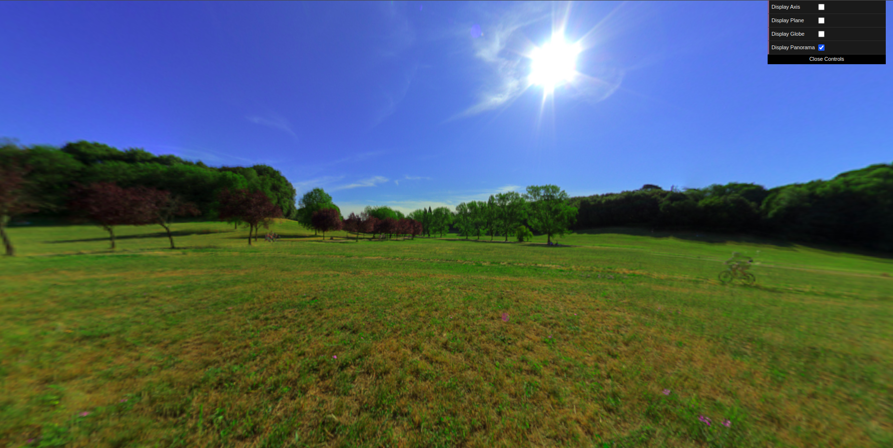
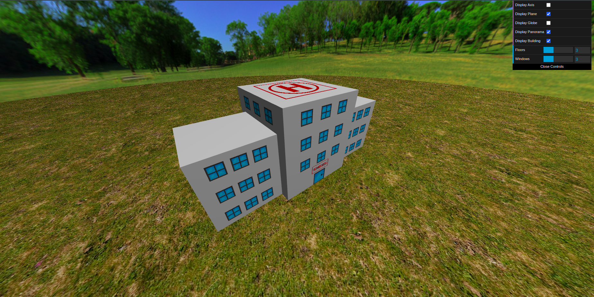

# CG 2024/2025

## Group T03G10

## Project Notes

### MyPanoram

Figura 1: Panorama (1ª perspetiva)

Figura 1b: Panorama (2ª perspetiva)

### MyBuilding

Figura 2: Edifício dos Bombeiros

### MyForest

Figura 3: Floresta

### MyHeli

Figura 4: Helicóptero

### MyHeli

Figura 5: Animação de voo do Helicóptero