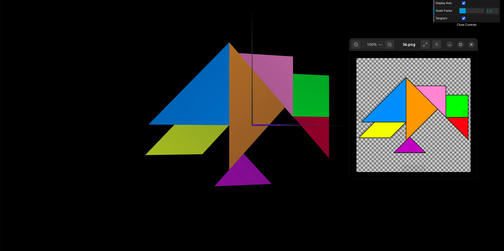
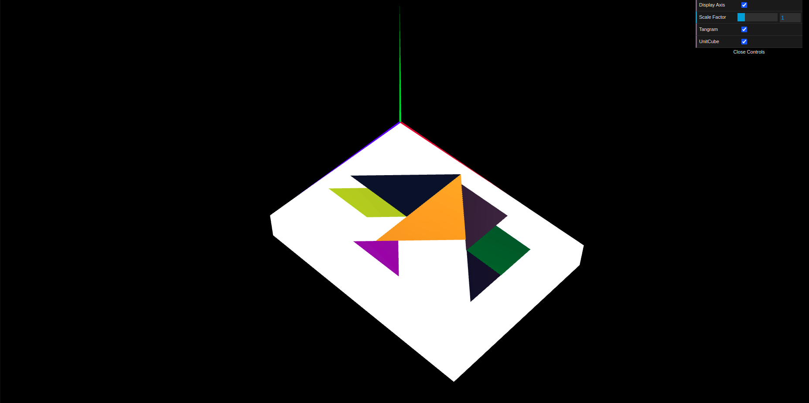
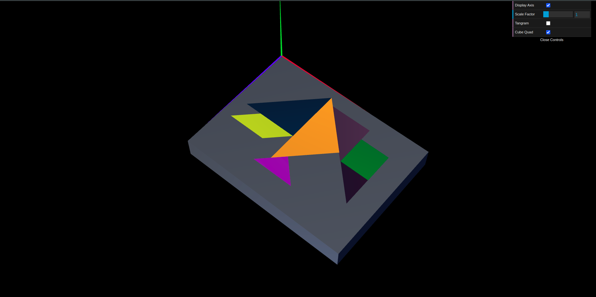

# CG 2024/2025

## Group T03G10

## TP 2 Notes

- No exercício 1, criamos o ficheiro **_myTangram.js_**, utilizando as formas geométricas definidas na aula prática anterior, mas desta vez, aplicando **translações**, **escalamentos** e **rotações**. Também alteramos a **cor** de cada **figura**. Mais uma vez, mantivemos a checkbox de controlo de visibilidade da figura. Manipulámos os **valores** em cada **transformação geométrica** para que o Tangram ficasse centrado e com a aparência pretendida. No final obtivemos o resultado que se segue na imagem.

Figura 1: Tangram

- No exercício 2, criamos um cubo unitário sendo este composto por 8 vértices e 6 faces, ou seja, representamos 12 triângulos para criar as faces do cubo. Tivemos o cuidado de fazer com que todas as faces ficassem fizíveis, evitando também criar faces visíveis no interior do cubo. Aplicamos algumas transformações geométricas no cubo, aumentando o tamanho do sólido e movendo a sua posição no referencial para que este servisse como uma base para o Tangram. Rodamos depois as duas figuras para que estas ficassem paralelas ao plano XZ e ajustamos a posição de ambas para que o vértice superior esquerdo da base ficasse na origem.

Figura 2: MyUnitCube + Tangram

- No exercício 3, mais uma vez criamos um cubo unitário, mas desta vez, não definimos as 6 faces usando 12 triângulos. Criamos apenas uma face (esta decomposta de igual modo em 2 triângulos) e reproduzimos essa mesma face outras 5 vezes, mas aplicando as rotações e translações necessárias para que o cubo mantenha o mesmo aspeto que o cubo unitário anteriormente reproduzido. Resumidamente, criamos através de um plano do cubo, os restantes necessários para a construção do sólido. Após isso, para manter a base com o grafismo anterior, aplicamos algumas transformações no cubo. Como podemos ver na imagem seguinte, a disposição ficou muito semelhante à da imagem anterior (alteramos as cores para distinguir as bases).

Figura 3: MyUnitCubeQuad + Tangram

