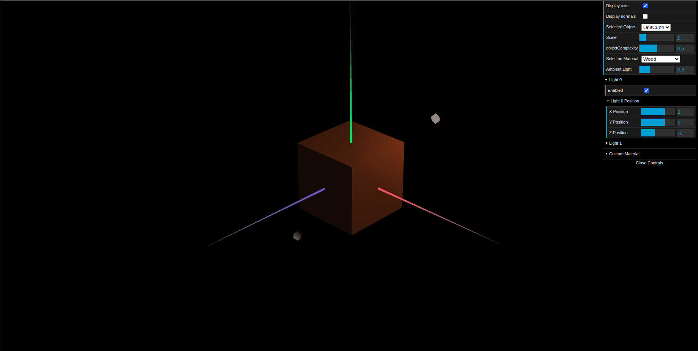
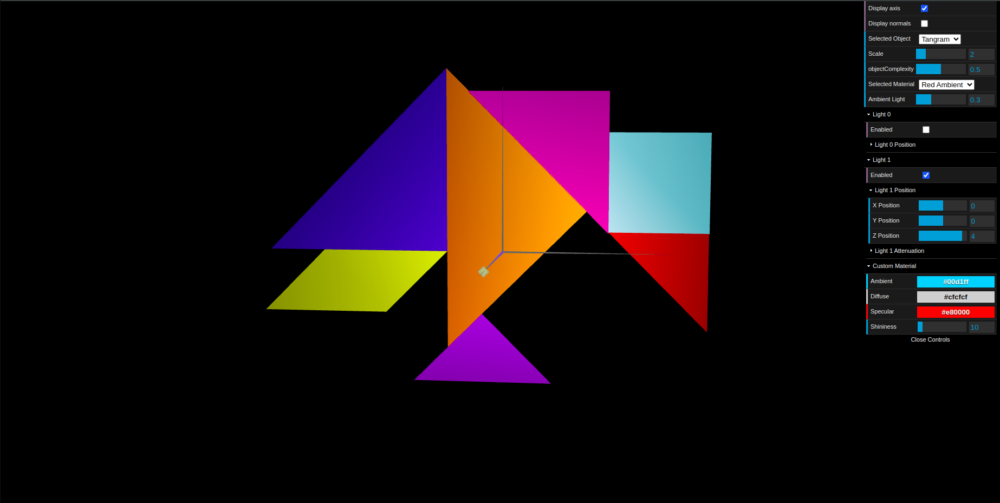
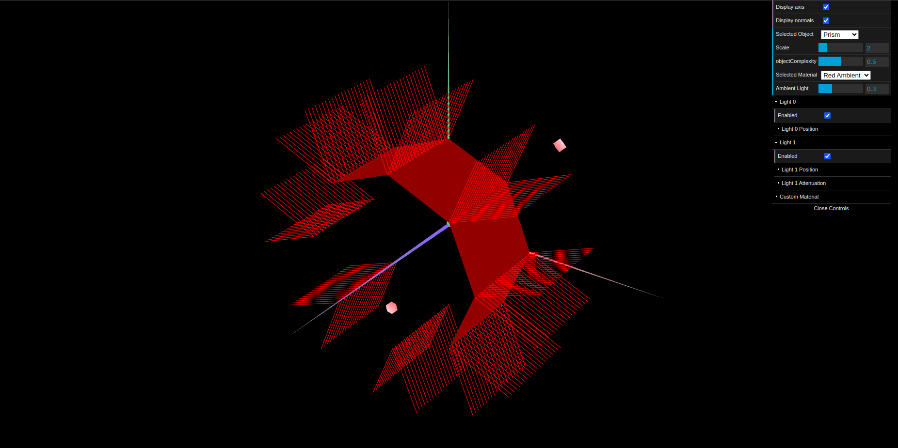

# CG 2024/2025

## Group T03G10

## TP 3 Notes

- No exercício 1, na primeira parte, criamos as normais para o cubo unitário e para o tangram trabalhados nas aulas anteriores para que a luminosidade destas fizesse sentido consoante as fontes luminosas e os ângulo des incidência das luzes. Para além disso criamos um material com uma cor castanha que se assemelhasse a madeira. Como pedido no guião, colocamos a componente escalar com um valor baixo.

Figura 1: Cubo de Madeira

- Na segunda parte do exercício 1, aplicamos diferentes materiais às figuras que compõem o tangram de modo a reproduzir as cores da figura original. O material do quadrado, (na figura original a verde), é costumizável, podendo ser alterado na interface.

Figura 2: Tangram e Materiais

- No exercício 2, implementamos um prisma com um número variável de lados e de andares, mas mantendo sempre a sua altura a 1 Implementamos um algoritmo que criasse os vértices, as normais e os índices do prisma.

Figura 3: Prisma de 8 lados e 20 andares