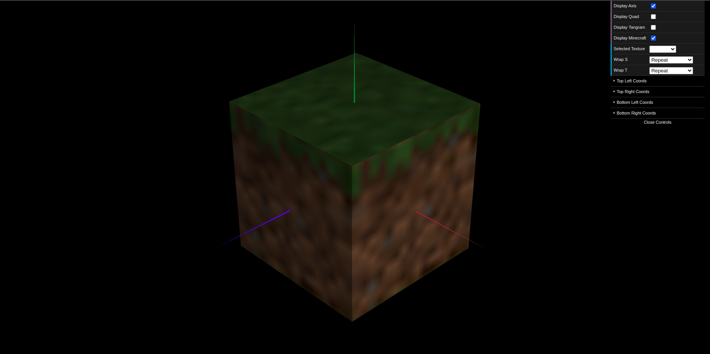
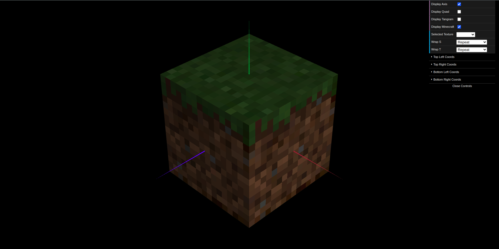

# CG 2024/2025

## Group T03G10

## TP 4 Notes

- No exercício 1, utilizamos a textura "tangram.png" para construir cada uma das figuras do tangram, **sem recorrer a cores sólidas**, utilizando apenas o **mapeamento da imagem**. Com a ajuda da imagem "tangram-lines.png", conseguimos **orientar corretamente a textura**, garantindo que as **figuras ficassem alinhadas** e semelhantes ao tangram original.
Para isso, **ajustamos as coordenadas da textura individualmente** para cada figura, assegurando que cada peça representasse fielmente a parte correspondente na imagem original.

Figura 1: Tangram com textura

Figura 2: Tangram com textura das linhas

- No exercício 2, colocamos **texturas do bloco de relva do Minecraft no cubo unitário** criado nas aulas anteriores. Aplicamos as textura de topo, laterais e base, respetivamente à face de topo, às faces laterais e à face de base. Reparamos que **inicialmente existia interpolação linear das cores**, uma vez que o **tamanho das texturas originais** (16 x 16 pixeis) é **muito inferior ao tamanho do cubo** (Figura 3), atribuindo um **desfoque à textura**. Alterámos depois o tipo de **filtragem para Nearest Neighbor**, que **desativa a interpolação e mantém os píxeis nítidos**, preservando o aspeto original da textura (Figura 4).

Figura 3: Bloco de relva do Minecraft (com interpolação)

Figura 4: Bloco de relva do Minecraft (sem interpolação)