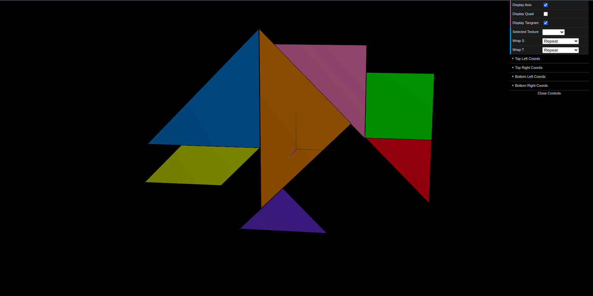
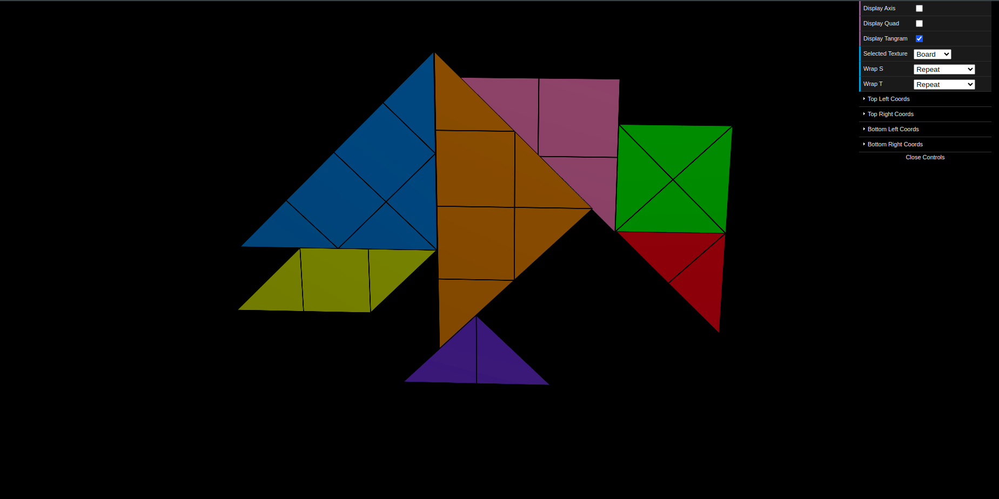

# CG 2024/2025

## Group T03G10

## TP 3 Notes

- No exercício 1, utilizamos a textura "tangram.png" para construir cada uma das figuras do tangram, **sem recorrer a cores sólidas**, utilizando apenas o **mapeamento da imagem**. Com a ajuda da imagem "tangram-lines.png", conseguimos **orientar corretamente a textura**, garantindo que as **figuras ficassem alinhadas** e semelhantes ao tangram original.
Para isso, **ajustamos as coordenadas da textura individualmente** para cada figura, assegurando que cada peça representasse fielmente a parte correspondente na imagem original.

Figura 1: Tangram com textura

Figura 2: Tangram com textura das linhas
