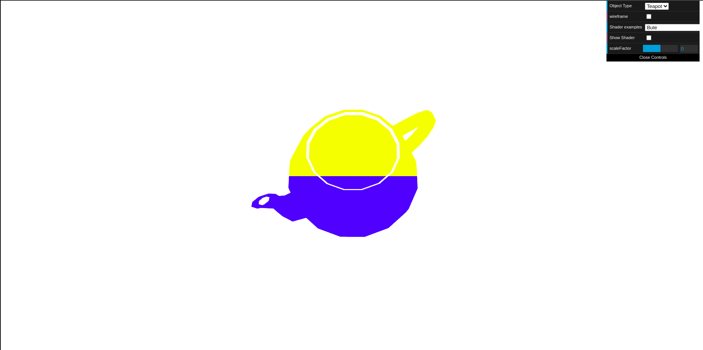
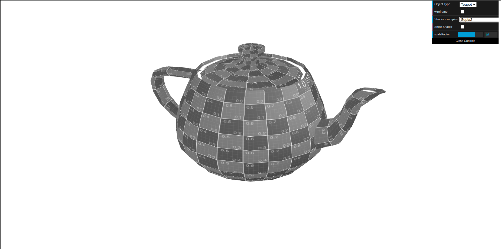

# CG 2024/2025

## Group T03G10

## TP 5 Notes

- No exercício 1, começamos por criar novos vertex e fragment shaders de modo a que a parte superior do bule ficasse a amarelo e a parte inferior do mesmo ficasse a azul. Para além disso fizemos com que o bule se movimenta-se segundo o eixo XX seguindo uma onda sinusoidal. A velocidade do movimento pode ser alterada no controlador.

Figura 1: Bule Amarelo e Azul

- Na segunda parte do exercício, com base na sepia previamente criada, pintamos o bule de cinzento.

Figura 2: Bule Cinza

- No exercício 2, aplicamos a textura da água com as sombras ao plano. As coordenadas da textura vão alterando ao longo do tempo e os vértices alteram-se consoante as componentes de cor da textura, criando uma sensação de relevo e movimento na água. 